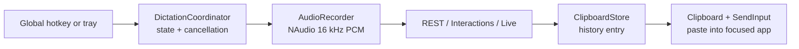

<div align="center">

# 🎙️ Voice IME for Windows

**System-wide voice dictation. Press Ctrl+Shift+Space and talk — anywhere.**

A tray-first Windows/WPF app: a global hotkey starts an in-memory recording,
Gemini transcribes it, and the result is pasted into the focused application.

[](https://github.com/arvindg4u/voice-ime-windows/actions/workflows/windows.yml)
[](https://github.com/arvindg4u/voice-ime-windows/releases)
[](https://www.microsoft.com/windows)
[](https://dotnet.microsoft.com)
[](https://learn.microsoft.com/dotnet/csharp)
[](LICENSE)

[Features](#-features) · [Quick start](#-quick-start) · [Configuration](#️-configuration) · [How it works](#-how-it-works) · [Build and test](#️-build-and-test) · [Privacy](#-privacy--security)

</div>

---

## ✨ Features

- **Works across Windows applications** — the registered global hotkey works
  from browsers, Office, editors, and chat apps.
- **Tray-first lifecycle** — the app starts without a settings window, keeps a
  single tray icon, and opens one WPF settings shell on demand. The tray menu
  provides Dictate/Cancel, History, Settings, Copy Last Transcript, and Quit.
- **Three activation modes** — Toggle, Push to talk, and Hold or toggle. The
  hold-style modes use physical-key polling plus a short release grace because
  `RegisterHotKey` supplies a press message but no key-up message.
- **Configurable capture** — NAudio requests 16 kHz, 16-bit mono, stereo, or
  averaged mono capture as selected. Gemini Live sessions force mono 16 kHz
  PCM; REST and Interactions requests use the selected WAV channel format.
- **Multiple Gemini transport paths** — ordinary models use
  `generateContent`, `gemini-3.5-transcribe` uses `/interactions`, and models
  whose names identify Live/native audio use a BidiGenerateContent WebSocket.
  Narrow server capability errors can retry the same request on the matching
  transport.
- **Multi-key rotation** — keys are tried round-robin; rate-limit responses
  advance to the next key and successful requests advance the persistent cursor.
- **Prompt library** — up to 20 named prompts, with a 2,000-character limit
  per prompt. The active prompt is used for dictation and the Gemini test tone.
- **Clipboard delivery** — the transcript is copied temporarily, pasted with
  Ctrl+V, Shift+Insert, or Ctrl+Shift+V, and the previous clipboard is restored
  when possible. Optional Enter submission is available for single-line targets.
- **Transcript history** — entries are stored newest-first under `%AppData%\VoiceIme`,
  with a configurable 10–500 entry cap. Pinned entries survive ordinary
  eviction where possible; audio is never saved.
- **Overlay and feedback controls** — recording/uploading/error status can be
  shown in a WPF pill; the waveform has a display-only volume control. Optional
  output muting is scoped to recording and restores the prior mute state.
- **Persistence and diagnostics** — settings are written atomically, API keys
  are DPAPI-protected for the current Windows user, and logs rotate at roughly
  500 KiB without transcript bodies or raw keys.

## 🚀 Quick start

**You need:** Windows 10 or later (x64), a microphone, and a
[Gemini API key](https://aistudio.google.com/apikey).

1. Download `VoiceIme.exe` from [Releases](https://github.com/arvindg4u/voice-ime-windows/releases)
   or the latest GitHub Actions artifact.
2. Run it. The app remains in the notification area.
3. Open **Settings → Gemini**, enter the base URL, one API key per line, and a
   model, then choose **Save**. The **Test** button sends a one-second 440 Hz
   tone through the configured transcription path.
4. Focus a text field, press the configured dictation hotkey, speak, and press
   the hotkey again. The transcript is pasted into the focused window.

To launch at sign-in, enable **Start with Windows** in Advanced settings. The
app creates or removes a shortcut in the user's Startup folder; it does not
install a service or require administrator privileges.

## ⚙️ Configuration

Settings are stored at `%AppData%\VoiceIme\settings.json`. API keys in that
file are encrypted with Windows DPAPI using the current-user scope.

| Setting | Default | Behavior |
| --- | --- | --- |
| Base URL | `https://generativelanguage.googleapis.com/v1beta` | Gemini-compatible REST base URL. The Live WebSocket uses its host. |
| API keys | empty | One key per line. Blank lines are ignored; rate limits rotate keys. |
| Model | `gemini-2.5-flash` | Routes to REST unless it is the Interactions allowlist model or a Live/native-audio candidate. |
| Custom prompts | empty | Named prompt library; active text is included as user preferences, up to 2,000 characters. |
| Dictation hotkey | `Ctrl+Shift+Space` | Any one-key chord with at least one Ctrl/Alt/Shift/Win modifier. |
| Activation mode | `Toggle` | Toggle, Push to talk, or Hold or toggle. |
| Microphone | System default | Selected WaveIn device; an unplugged choice falls back to the WaveIn system mapper. |
| Capture channel | `Mono` | Mono, Stereo, or Mix-down (average). Live always records mono. |
| Mute while recording | Off | Mutes the selected render endpoint, or the default output, and restores its previous state. |
| Output device | System default | Used by the speaker test tone and output mute fallback. |
| Paste method | `Ctrl+V` | Also supports Shift+Insert and Ctrl+Shift+V. |
| Auto-submit | Off | Sends Enter after a successful paste. |
| Show overlay | Full | Full pill, Minimal pill without waveform, or None. |
| History limit | 100 | Clamped to 10–500 entries. |
| Start hidden | On | Keeps the normal launch in the tray; turn it off to open Settings at sign-in. Disabling the tray icon still surfaces the settings window so the app cannot become unreachable. |
| Theme | System | System, Light, or Dark; changes apply immediately. |

### Transport routing

Routing is deterministic and intentionally conservative:

- `gemini-3.5-transcribe` uses the Interactions-style `POST {base}/interactions`
  request with verbatim/smart transcription configuration.
- Model names containing `-live`, `live-preview`, `native-audio`, or `-dialog`
  use Gemini Live BidiGenerateContent over WebSocket. Live sends raw mono
  16-bit 16 kHz PCM in bounded chunks and finalizes only after the drain is
  complete.
- Other models use `POST {base}/models/{model}:generateContent` with inline
  WAV audio.
- A REST HTTP 400 only falls back when the response explicitly identifies a
  Live-only model or unsupported developer instruction. Other errors are
  surfaced without exposing the server body.

## 🔄 Key rotation

For REST, Interactions, and complete (non-streaming) Live requests, keys are
normalized, blank values are discarded, and the request begins at the
persisted cursor:

The interactive streaming path selects the cursor key once at recording start.
It does not replay a partially streamed recording onto another key; a Live
rate-limit failure is surfaced for retry instead.

```text
keys = [k1, k2, k3], cursor = 0
request → try k1 → rate limited? try k2 → success → cursor = (used + 1) % 3
next request starts at the new cursor
401 / other non-rate-limit error → fail immediately
all keys rate limited → "Rate limited on all keys — retry later"
```

## 🧠 How it works



The coordinator owns the `Idle → Recording → Uploading → Error` lifecycle and
session generation. Capture buffers and request payloads are memory-only and
cleared on completion, cancellation, failure, and transport fallback. Live
recording uses a bounded producer/consumer pump so setup latency cannot grow an
unbounded audio queue; a failed Live session never finalizes or pastes.

## 🏗️ Architecture

```text
src/VoiceIme/
├── App.xaml(.cs)                  # tray lifecycle and pipeline orchestration
├── MainWindow.xaml(.cs)           # shared WPF settings shell/navigation
├── Views/                         # General, Gemini, History, Advanced, About
├── AudioRecorder.cs               # NAudio WaveIn capture and WAV encoding
├── AudioOutputMute.cs             # scoped render-endpoint mute restoration
├── LlmClient.cs                   # transport routing and request ownership
├── RestTranscriptionTransport.cs  # Gemini generateContent
├── InteractionsTranscriptionTransport.cs
├── LiveTranscriptionTransport.cs  # Gemini Live WebSocket transport
├── LiveSession.cs / LivePcmPump.cs
├── SettingsStore.cs               # DPAPI settings + atomic migration
├── ClipboardStore.cs              # configurable transcript history
├── HotkeyWindow.cs / NativeInput.cs
├── OverlayWindow.xaml(.cs)         # recording/upload/error pill
└── Theme/                          # dynamic light/dark WPF resources

tests/VoiceIme.Tests/               # xUnit unit, transport, persistence, and WPF tests
```

The application targets `net8.0-windows`, uses WPF plus WinForms for the tray,
NAudio for capture/playback, and publishes a self-contained `win-x64` single
file. The repository does not contain the former standalone
`SettingsWindow.xaml` or `HistoryWindow.xaml`; their functionality is hosted by
the `MainWindow` sections.

## 🛠️ Build and test

On a Windows machine with the .NET 8 SDK:

```powershell
git clone https://github.com/arvindg4u/voice-ime-windows
cd voice-ime-windows

dotnet test VoiceIme.Windows.sln -c Release

dotnet publish src/VoiceIme/VoiceIme.csproj -c Release -r win-x64 --self-contained `
  /p:PublishSingleFile=true /p:IncludeNativeLibrariesForSelfExtract=true -o publish
```

The Windows workflow runs the Release test suite and publishes `publish/VoiceIme.exe`
as an artifact. A tag matching `v*` runs the release workflow and attaches the
EXE to the GitHub Release.

### Validation status for this review

The current review environment is Linux and does not have the .NET SDK, MSBuild,
or a C# compiler installed, so local compilation and tests could not be run
here. The Windows CI workflow is the authoritative compile/test check.

A real Windows EXE smoke test is still outstanding. Before calling a build
release-ready, run the published EXE on Windows and verify at least:

- microphone permission, selected input, mono/stereo/mix-down WAV behavior,
  five-minute auto-stop, and cancellation;
- selected output test tone, mute restoration after success, failure, cancel,
  unplug, and shutdown;
- global hotkey capture/registration, Toggle/Push-to-talk/Hold-or-toggle,
  overlay modes, tray/second-instance behavior, clipboard restoration,
  paste methods, and optional auto-submit;
- REST/Interactions/Live model routing, API-key rotation, network failure,
  empty/final Live transcript handling, history eviction/pinning, and
  startup shortcut reconciliation.

## 📏 Limits and known Windows constraints

- Recordings are bounded to five minutes and are not written to disk.
- The inline REST request contains base64 audio, so very large recordings can
  approach service/request limits.
- `SendInput` cannot paste into a higher-integrity elevated application unless
  Voice IME also runs elevated. The transcript remains in History if delivery
  fails.
- Only English UI strings are shipped in this version; the language preference
  is persisted for forward compatibility.
- Device names are persisted by friendly name. If a device is unplugged, input
  capture falls back to the WaveIn system mapper and output playback/mute falls
  back to the system default.
- Gemini API availability and model names are service-dependent; model-name
  routing is conservative and the server remains authoritative.

## 🔒 Privacy & security

- **Audio is memory-only.** WAV/PCM buffers are zeroed after recording and
  transport use, including failed and cancelled paths. The history stores text,
  not audio.
- **Keys are DPAPI-protected.** Raw API keys are not written to settings or
  logs. The logger records only safe event data, key-slot numbers, short
  fingerprints, and transcript lengths.
- **Clipboard is restored when possible.** A failed or interrupted paste cannot
  be assumed to have delivered; the transcript is retained in History.
- **Network egress** goes to the configured Gemini-compatible endpoint. Live
  sessions place the key in the WebSocket query required by the API; it is not
  logged or surfaced in UI errors.

## ❓ Troubleshooting

<details>
<summary><strong>Hotkey does nothing</strong></summary>

Another application may own the chord. Choose a different chord in General
settings, or use the tray's Dictate action. A failed registration keeps the
previous working chord.
</details>

<details>
<summary><strong>No microphone found / access denied</strong></summary>

Check Windows microphone privacy settings and the selected input device. An
unavailable saved device falls back to the WaveIn system mapper; reconnect it
or choose System default.
</details>

<details>
<summary><strong>Invalid API key / rate limited</strong></summary>

Check the base URL, model, and keys. A 401 fails fast; a rate-limit response
tries the remaining keys. Add another key or wait before retrying.
</details>

<details>
<summary><strong>Paste does not land</strong></summary>

Focus the target field before dictating. Elevated applications require Voice
IME to run at the same integrity level. Use History to copy the transcript if
pasting fails.
</details>

## 🤝 Contributing

```powershell
dotnet test VoiceIme.Windows.sln -c Release
```

Keep the tray-first Windows app purpose, add tests for OS-independent logic,
and do not persist microphone audio or introduce plaintext key storage. Pull
requests should describe the Windows version and manual smoke-test coverage.

## 📄 License

MIT. See [LICENSE](LICENSE).
