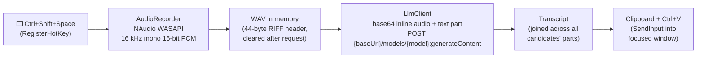
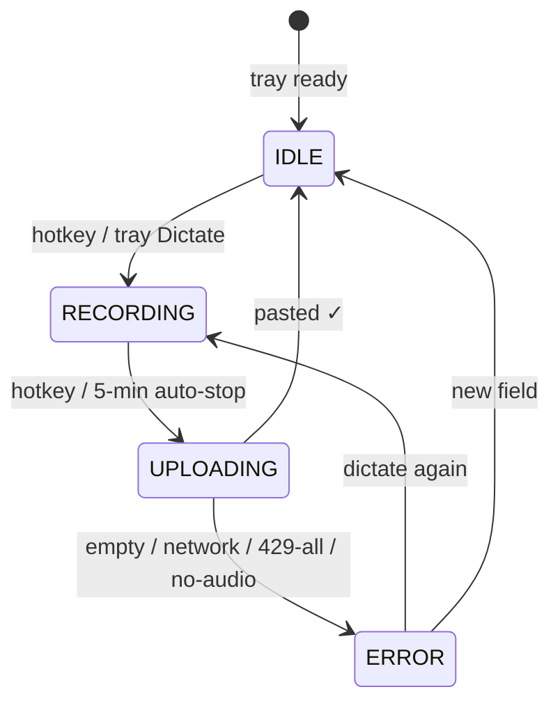

<div align="center">

# 🎙️ Voice IME for Windows

**System-wide voice dictation. Press Ctrl+Shift+Space and talk — anywhere.**

A tray-first Windows app: global hotkey → record → transcribe with Gemini →
paste into the focused window. The Windows sibling of
[voice-ime-android](https://github.com/arvindg4u/voice-ime-android) — same
core architecture, native C# port.

[](https://github.com/arvindg4u/voice-ime-windows/actions/workflows/windows.yml)
[](https://github.com/arvindg4u/voice-ime-windows/releases)
[](https://www.microsoft.com/windows)
[](https://dotnet.microsoft.com)
[](https://learn.microsoft.com/dotnet/csharp)
[](LICENSE)

[Features](#-features) · [Quick start](#-quick-start) · [How it works](#-how-it-works) · [Architecture](#️-architecture) · [Privacy](#-privacy--security)

</div>

---

## Table of contents

- [Why a Windows twin](#why-a-windows-twin)
- [✨ Features](#-features)
- [🚀 Quick start](#-quick-start)
- [⚙️ Configuration](#️-configuration)
- [🔄 Key rotation](#-key-rotation)
- [💬 Custom prompt](#-custom-prompt)
- [🧠 How it works](#-how-it-works)
- [🏗️ Architecture](#️-architecture)
- [🛠️ Build from source](#️-build-from-source)
- [✅ Testing](#-testing)
- [📏 Limits](#-limits)
- [🔒 Privacy & security](#-privacy--security)
- [❓ FAQ & troubleshooting](#-faq--troubleshooting)
- [🤝 Contributing](#-contributing)
- [🙏 Acknowledgments](#-acknowledgments)

---

## Why a Windows twin

Windows has no IME slot for a voice-only keyboard — but it has something
better for dictation: a **global hotkey that works in every app**. Voice IME
for Windows keeps the Android core (record 16 kHz WAV → Gemini
`generateContent` → deliver transcript) and swaps only the platform edges:

| Android | Windows |
| ------- | ------- |
| `InputMethodService` mic tap | Global hotkey **Ctrl+Shift+Space** from any app |
| `AudioRecord` | NAudio capture (16 kHz requested from the OS mixer) |
| `commitText` into editor | Clipboard + synthesized **Ctrl+V** into focused window |
| `EncryptedSharedPreferences` | DPAPI (`ProtectedData`, CurrentUser scope) |
| Material 3 IME view | Tray icon + WPF settings/history windows |
| Debug APK from CI | Single-file `VoiceIme.exe` from CI |

> **Thirty-second pitch:** run `VoiceIme.exe`, paste a Gemini API key, press
> **Ctrl+Shift+Space** in any text field — then talk.

---

## ✨ Features

- **Works everywhere** — global hotkey fires from browsers, Office, editors,
  chat apps: anywhere with a text field.
- **Tray-first** — `NotifyIcon` owns the lifecycle: Dictate / Settings /
  History / Quit. No window clutter.
- **Voice pipeline** — 16 kHz mono 16-bit PCM → in-memory WAV → Gemini
  `generateContent` with base64 inline audio.
- **Clipboard + Ctrl+V delivery** — transcript lands in the focused window;
  your previous clipboard is restored afterwards.
- **Multi-key rotation** — round-robin across keys with automatic 429
  failover and even load spread (identical semantics to Android).
- **User-shaped transcription** — custom system prompt (≤ 2000 chars) steers
  formatting, language, tone — including the Test button.
- **Clipboard history** — every transcript saved to `%AppData%` (cap 100,
  pinned survive eviction); pin / delete / clear-unpinned.
- **Test button** — sends a 1-second 440 Hz tone through the full pipeline to
  verify keys/model/prompt before dictating.
- **State in the tray** — tooltip + balloon tips mirror
  idle → recording → transcribing → pasted/error.
- **Resilient recording** — hotkey toggles start/stop, 5-min auto-stop, mic
  teardown off the UI thread.

---

## 🚀 Quick start

**You need:** Windows 10+ (x64) and a
[Gemini API key](https://aistudio.google.com/apikey). No install, no admin —
it's a single portable EXE.

```text
1. Open Releases → download VoiceIme.exe
   https://github.com/arvindg4u/voice-ime-windows/releases
   (or Actions → latest Windows run → Artifacts → voice-ime-windows)
2. Run VoiceIme.exe — it lives in the tray.
3. Tray → Settings… → paste Base URL / API keys / Model → Save → Test.
4. Focus any text field, press Ctrl+Shift+Space, talk, press it again.
```

> **Launch at login:** press `Win+R` → `shell:startup` → drop a shortcut to
> `VoiceIme.exe` there.

---

## ⚙️ Configuration

Settings persist to `%AppData%/VoiceIme/settings.json`. API keys are
DPAPI-encrypted at rest and never logged.

| Field | Default / example | What it does |
| ----- | ----------------- | ------------ |
| **Base URL** | `https://generativelanguage.googleapis.com/v1beta` | Gemini-compatible endpoint. Swap for a proxy without rebuilding. |
| **API keys** | one key per line | Round-robin pool with 429 failover (see below). |
| **Model** | `gemini-2.5-flash` | Model appended as `{baseUrl}/models/{model}:generateContent`. |
| **Custom prompt** | blank (disabled) | System instructions (max 2000 chars) under a *"User preferences:"* heading on every request, including Test. |

---

## 🔄 Key rotation

Identical to Android — load spreads instead of hammering key #1:

```text
keys = [k1, k2, k3], cursor starts at 0
request → try k1 → 429? → try k2 → success → cursor = (1 + 1) % 3 = 2
next request starts at k3 …
all keys 429'd → "Rate limited on all keys — retry later"
401 / other non-429 → fail immediately (never burns the other keys)
```

---

## 💬 Custom prompt

| Goal | Prompt to paste |
| ---- | --------------- |
| Formatting | `Add punctuation and paragraph breaks.` |
| Hinglish keep-as-is | `Keep Hinglish words as-is, don't translate them.` |
| Hindi script | `Reply in Hindi script (Devanagari).` |

---

## 🧠 How it works

### Pipeline



### State machine



---

## 🏗️ Architecture

**Stack:** C# 12 · .NET 8 (Windows) · WPF + WinForms tray · NAudio · xUnit ·
single-file self-contained `win-x64` EXE.

```text
src/VoiceIme/                      # WPF WinExe, net8.0-windows
├── App.xaml(.cs)                  # tray lifecycle, hotkey wiring, orchestration
├── HotkeyWindow.cs                # message-only window owning RegisterHotKey
├── AudioRecorder.cs               # WASAPI capture → WAV, levels, 5-min cap
├── LlmClient.cs                   # REST transcription + key rotation
├── NativeInput.cs                 # RegisterHotKey + clipboard/Ctrl+V via SendInput
├── SettingsStore.cs               # DPAPI-encrypted settings (%AppData%)
├── ClipboardStore.cs              # transcript history (cap 100, pin survives)
├── SettingsWindow.xaml(.cs)       # settings form + Test button
└── HistoryWindow.xaml(.cs)        # history list (copy / pin / delete)

tests/VoiceIme.Tests/              # xUnit + RichardSzalay.MockHttp
├── AudioRecorderTests.cs          # WAV header, test tone, magnitude, silence
├── LlmClientTests.cs              # success, 429 rotation, 429-all, 401, parsing
├── ClipboardStoreTests.cs         # ordering, eviction, pins, delete
└── SettingsStoreTests.cs          # DPAPI round-trip, no plaintext on disk
```

**Android mapping** (same core, different edges): `AudioRecorder`→NAudio,
`LlmClient`→`HttpClient` + same rotation, `commitText`→clipboard+Ctrl+V,
`EncryptedSharedPreferences`→DPAPI, `IME view`→tray+WPF, `gradlew`→`dotnet`.

**CI/CD** (`.github/workflows/`): `windows.yml` runs `dotnet test` + publishes
the single-file EXE on every push/PR; `release.yml` attaches `VoiceIme.exe`
to the GitHub Release on `v*` tags. Nothing is ever built locally.

---

## 🛠️ Build from source

```powershell
# Requirements: .NET 8 SDK (Windows)

git clone https://github.com/arvindg4u/voice-ime-windows
cd voice-ime-windows

# Tests (must stay green)
dotnet test VoiceIme.Windows.sln -c Release

# Single-file EXE → publish/VoiceIme.exe
dotnet publish src/VoiceIme/VoiceIme.csproj -c Release -r win-x64 --self-contained `
  /p:PublishSingleFile=true /p:IncludeNativeLibrariesForSelfExtract=true -o publish
```

> You don't need to — CI builds the EXE on every push. This is for contributors.

---

## ✅ Testing

| Layer | How |
| ----- | --- |
| Unit | `dotnet test` — WAV encoding, key rotation (mock HTTP incl. 429/401), eviction/pins, DPAPI round-trip |
| Manual Test button | Settings → **Test** sends the 440 Hz tone end-to-end |
| Manual flows | dictate into Notepad → paste · no-key error · all-429 error · airplane-mode retry · 5-min auto-stop · elevated-app limitation |

> **Linux note:** this is a Windows GUI app (`net8.0-windows`, WPF). On
> Linux only what is OS-independent can be tested — `dotnet build` proves
> compile (via `EnableWindowsTargeting`), and STA view tests construct real
> WPF controls, so they pass vacuously with no window station (see
> `StaTestHelper`/`WpfStaCollection`). Full GUI-level coverage runs only on
> windows-latest CI (`.github/workflows/windows.yml` → `dotnet test`).

---

## 📏 Limits

- **Recording cap: 5 min** — same math as Android (≈13 MB request JSON, under
  the 20 MB inline-audio ceiling).
- **Network-bound** — offline shows an explicit error with retry.
- **Elevated windows excluded** — `SendInput` Ctrl+V can't reach apps running
  as Administrator unless Voice IME also runs elevated. Clipboard history still
  captures the transcript, so nothing is lost.
- **Windows-only** — x64, Windows 10+. No ARM64 build yet (add a
  `win-arm64` publish leg when needed).

---

## 🔒 Privacy & security

- **Memory-only audio** — recordings live in RAM and are zeroed after each
  request. Nothing written to disk.
- **DPAPI-encrypted keys** — `ProtectedData` CurrentUser scope; the settings
  file contains only ciphertext. Keys never logged.
- **Minimal surface** — no installer, no admin, no services, no autostart
  without your shortcut. Network egress is only to your configured Base URL.
- **Explicit consent** — Windows mic permission prompt at first capture.

> Found a vulnerability? Please open a **private security advisory** on GitHub
> instead of a public issue.

---

## ❓ FAQ & troubleshooting

<details>
<summary><strong>"No API key — open Settings"</strong></summary>

The key pool is empty. Tray → Settings… → paste at least one key → Save → Test.
</details>

<details>
<summary><strong>"Rate limited on all keys — retry later"</strong></summary>

Every key returned 429. Wait a minute or add a key from another project. A 401
fails fast instead — check that key.
</details>

<details>
<summary><strong>Paste doesn't land in the app</strong></summary>

Click the text field first, then dictate. If the target runs as Administrator
(e.g. elevated Task Manager), relaunch Voice IME as admin — or copy from
History.
</details>

<details>
<summary><strong>Hotkey does nothing</strong></summary>

Another app may have claimed Ctrl+Shift+Space. Close overlays/clipboard
managers and retry. Tray → Dictate always works as a fallback.
</details>

<details>
<summary><strong>"No speech detected" / empty transcript</strong></summary>

Speak closer/louder, check Windows mic input level, and make the recording
longer than ~0.5 s.
</details>

---

## 🤝 Contributing

```powershell
dotnet test VoiceIme.Windows.sln -c Release   # must stay green
```

- **Issues:** Windows version, app version, model, exact tray/toast message.
- **PRs:** keep the tray-first concept; add/update xUnit tests for logic;
  keep functions focused and errors explicit.
- **No-goes:** installers/services, disk persistence of audio, unencrypted key
  storage, new network endpoints without discussion.

---

## 🙏 Acknowledgments

Core architecture ported from
[voice-ime-android](https://github.com/arvindg4u/voice-ime-android) (same
author). Transcription by the [Gemini API](https://ai.google.dev). Audio via
[NAudio](https://github.com/naudio/NAudio).
